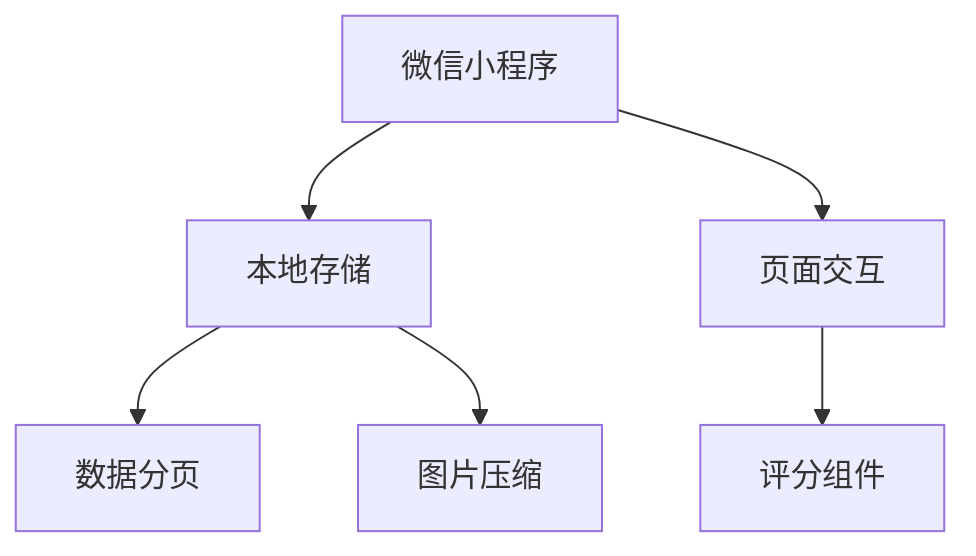

# 吃什么好呢 (WhatToEat)

微信小程序解决方案，帮助用户管理个人菜品库并解决饮食选择困难

## 功能特性

- 🍳 菜品管理（增删改查）
- ⭐ 收藏夹功能
- 🌟 五星评分系统
- 🎲 智能随机推荐
- 📷 图片管理（最多1张/菜品）

## 技术架构



## 数据结构

```typescript
interface Dish {
  id: string;
  name: string;
  tags: string[];
  recipe: string[];
  image: string;
  createTime: number;
  isFavorite: boolean;
  userRating: 0|1|2|3|4|5;
  updateTime?: number;
}
```

## 核心逻辑

### 随机选择算法

```javascript
function randomSelect(dishes, filters) {
  const pool = applyFilters(dishes, filters);
  shuffleArray(pool); // Fisher-Yates算法
  return pool[0];
}
```

## 使用指南

1. 点击右下角"+"添加新菜品
2. 在列表页滑动浏览已有菜品
3. 使用随机页面的筛选器获取推荐
4. 长按菜品卡片进行收藏/评分

## 注意事项

⚠️ 本地存储限制：单个菜品不超过500KB
⚠️ 建议定期导出重要数据备份
